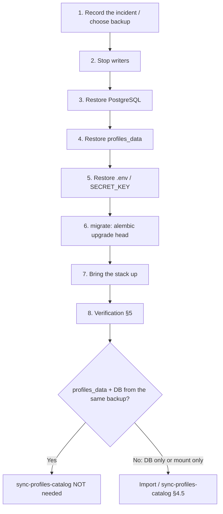

# SecAudit — Backup / Restore Runbook

Practical runbook for backup and restore of a Compose stand.

**Related documents:** [ops-runbook](ops-runbook.md) (operations, migrations, empty profiles catalog), [README](../README.md).

**Do not invent infrastructure:** the dev Compose stack has **no** PostgreSQL WAL archiving, Redis has **no persistence**, and Keycloak runs in `start-dev --import-realm` mode. Point-in-time recovery (PITR) is **not supported** in the lab Compose setup — only a snapshot as of the `pg_dump` moment.

---

## 0. What we protect (prerequisites)

### Services and volumes

| Component | Compose service / volume | Path / notes |
|-----------|-------------------------|----------------|
| PostgreSQL | `postgres`, volume `postgres_data` | DB `secaudit`, user `secaudit` (see `.env`) |
| Profiles catalog (import) | bind mount `PROFILES_SOURCE_PATH` | `./profiles` → `/profiles:ro` in `api`/`worker` |
| Imported packages | volume **`profiles_data`** | `/data/profiles` (`PROFILES_STORAGE_PATH`) |
| Redis | `redis` | broker `/0`, results `/1` — **ephemeral** in dev Compose |
| Keycloak | `keycloak` | realm from `./infra/keycloak` (import on start) |
| Secrets | `.env` (not in git) | `SECRET_KEY` (Fernet credentials), DB passwords, bootstrap |

**Physical volume names** (Docker Compose v2): `<project>_postgres_data`, `<project>_profiles_data`, where `<project>` is the Compose project name.

```powershell
docker volume ls --filter name=profiles_data
docker volume ls --filter name=postgres_data
```

### Two profiles directories — do not confuse them

| Path in container | Source | Contents |
|-------------------|----------|------------|
| `/profiles` | bind `./profiles` (or `PROFILES_SOURCE_PATH`) | Package catalog in the repository; **read-only**; discovery / bulk-import / `sync-profiles-catalog` |
| `/data/profiles` | volume `profiles_data` | **Copies** of packages after import; runtime looks here during runs |

Import (`POST /api/v1/profiles/import`, UI, `sync_profiles_catalog`) copies a package from `/profiles` into `/data/profiles` and creates rows in PostgreSQL.  
**Backing up only `./profiles` without `profiles_data` + the DB** → the UI will show profiles from the DB, but files on disk may be missing.  
**Backing up only `profiles_data` without the DB** → files exist, but metadata/rules/jobs do not.

### Legacy: `standards_data`

Older installations may still have volume **`<project>_standards_data`** (from before the rename). It is **not mounted** in the current Compose stack. Before migrating data:

```powershell
docker volume inspect YOUR_PROJECT_standards_data   # if it exists
# copy contents → YOUR_PROJECT_profiles_data (see §4.3)
```

---

## 1. RPO / RTO (honest targets)

### Compose lab / on-prem installation (as-is)

| Metric | Recommended target | Rationale |
|---------|-------------------|-------------|
| **RPO** | **24 h** (daily backup) or **≤ 4 h** with cron every 4 h | No PITR; data loss = interval between snapshots + unfinished transactions after the last `pg_dump` |
| **RTO** | **1–4 h** (manual restore + verification) | Single operator, Compose stop/start; practice drills are mandatory |
| **RPO Redis** | **not guaranteed** | Celery queues, heartbeat keys — acceptable to recreate; stuck runs — sweeper / manual cancel ([ops-runbook §1](ops-runbook.md#1-stuck--frozen-run-compliance--remediation)) |

### Production (recommendations, not implemented in dev Compose)

| Metric | Target | How to achieve |
|---------|----------|-------------|
| **RPO** | 15 min – 1 h | Managed PostgreSQL + WAL / continuous archiving; frequent logical backup |
| **RTO** | 30 min – 2 h | Automated restore, runbook in CI, separate DR stand |
| **Backup encryption** | required | KMS / GPG at rest; secrets — separate from the DB dump |

Document the **actual** RPO/RTO of the chosen stack and a hardening plan for production (managed PG, external secrets, encrypted backups).

---

## 2. What to include in a backup

### Required (minimum to restore the platform)

1. **PostgreSQL** — `pg_dump` custom format (`-Fc`)
2. **`profiles_data`** — tar of volume `/data/profiles`
3. **`.env`** (or secrets export from Vault) — **separately**, encrypted, **never in git**

### Strongly recommended

4. **`./profiles`** — if the host catalog was changed/extended outside git (otherwise restore from the repository)

### Optional

| Object | When needed | Compose lab |
|--------|-------------|-------------|
| **Redis** | Preserve the task queue “as is” | Usually **not backed up**; `redis-cli SAVE` + copy RDB — only if persistence is enabled in prod |
| **Keycloak realm** | Custom users/roles beyond `./infra/keycloak` | Dev: git copy of `infra/keycloak` is enough; prod: export realm via Admin API |
| **Observability** (`prometheus_data`, `tempo_data`, `grafana_data`) | Metrics/traces history | `observability` profile — optional |

### Secrets

| Secret | Consequence of changing it on restore |
|--------|-------------------------------|
| `SECRET_KEY` | Decrypting **credentials** in the DB is impossible → you need the same key as at backup time |
| `POSTGRES_PASSWORD` | Must match `.env` and `docker-compose.yml` / override |
| Keycloak / JWT | `KEYCLOAK_ISSUER` and realm must match issued tokens |

Store a copy of `.env` in a password manager / Vault; put only an **encrypted** archive into the `backups/` directory (for example 7-Zip AES / GPG).

---

## 3. Backup

All commands are run **from the repository root**. PowerShell is primary; for bash replace paths and `$env:VAR` → `$VAR`.

### 3.1 Prepare the directory

```powershell
$ts = Get-Date -Format "yyyyMMdd_HHmmss"
$dest = "backups\backup_$ts"
New-Item -ItemType Directory -Force -Path $dest | Out-Null
```

The `backups/` directory is in `.gitignore` — artifacts are not committed.

### 3.2 PostgreSQL (custom format)

The snapshot is **logically consistent** if there is no active DDL during the dump; for the lab it is enough to briefly stop writers:

```powershell
docker compose stop api worker beat
docker compose exec postgres pg_dump -U secaudit -d secaudit -Fc -f /tmp/secaudit.dump
docker compose cp postgres:/tmp/secaudit.dump "$dest\postgres_secaudit.dump"
docker compose exec postgres rm -f /tmp/secaudit.dump
docker compose start api worker beat
```

**Without stopping** (higher risk on a heavily loaded DB; usually OK for the lab):

```powershell
docker compose exec -T postgres pg_dump -U secaudit -d secaudit -Fc -f /tmp/secaudit.dump
docker compose cp postgres:/tmp/secaudit.dump "$dest\postgres_secaudit.dump"
docker compose exec postgres rm -f /tmp/secaudit.dump
```

File check:

```powershell
docker compose exec postgres pg_restore -l /tmp/check.dump  # after cp into the container
# or on the host — size > 0, date matches the backup
Get-Item "$dest\postgres_secaudit.dump" | Format-List Name, Length, LastWriteTime
```

### 3.3 Volume `profiles_data`

```powershell
$vol = (docker volume ls -q --filter name=profiles_data | Select-Object -First 1)
if (-not $vol) { throw "Volume profiles_data not found" }

docker run --rm `
  -v "${vol}:/data:ro" `
  -v "${PWD}\${dest}:/backup" `
  alpine tar czf /backup/profiles_data.tar.gz -C /data .
```

### 3.4 Directory `./profiles` (optional)

```powershell
tar -czf "$dest\profiles_source.tar.gz" -C profiles .
# Windows without tar: Compress-Archive (slower on large trees) or WSL tar
```

### 3.5 Backup metadata (manifest)

```powershell
docker compose exec -T api alembic current 2>$null | Out-File "$dest\alembic_revision.txt"
docker compose ps --format json | Out-File "$dest\compose_ps.json"
Get-Content .env.example | Out-File "$dest\env_example_snapshot.txt"   # do not copy secrets into the manifest without encryption
@"
backup_timestamp=$ts
postgres_db=secaudit
profiles_volume=$vol
alembic_head=050_profile_name_encoding
"@ | Out-File "$dest\manifest.txt"
```

### 3.6 Wrapper script

```powershell
.\scripts\backup.ps1
.\scripts\backup.ps1 -IncludeProfilesSource
.\scripts\backup.ps1 -BackupRoot backups -StopWriters
```

---

## 4. Restore

### 4.1 Operation order (full DR)



| Step | Action | Why |
|-----|----------|-------|
| 1 | Choose directory `backups\backup_YYYYMMDD_HHMMSS` | Consistent dump + tar pair |
| 2 | `docker compose stop api worker beat frontend` | Close PG connections; unmount writers from `profiles_data` |
| 3 | Restore PostgreSQL (§4.2) | Metadata, jobs, hosts, credentials |
| 4 | Restore `profiles_data` (§4.3) | Files of imported packages |
| 5 | Restore `.env` (**same `SECRET_KEY`**) | Credentials + auth |
| 6 | `docker compose run --rm migrate` | Schema to head if the backup is older than the code |
| 7 | `docker compose up -d` | Full stack |
| 8 | Verification §5 | Compliance gate |

**Do not run** `docker compose down -v` — it deletes volumes ([ops-runbook](ops-runbook.md)).

### 4.2 PostgreSQL restore

```powershell
docker compose stop api worker beat frontend

docker compose cp "$dest\postgres_secaudit.dump" postgres:/tmp/restore.dump

# --clean --if-exists: drop objects from the dump before create (careful on a shared DB)
docker compose exec postgres pg_restore -U secaudit -d secaudit `
  --clean --if-exists --no-owner --role=secaudit -v /tmp/restore.dump

docker compose exec postgres rm -f /tmp/restore.dump
```

If `pg_restore` emits warnings about “already exists” / FK — typical for a repeated restore onto the same DB; check `alembic current` and health.

**Full DB recreation** (last resort, lab only):

```powershell
docker compose stop api worker beat frontend postgres
docker compose rm -f postgres
docker volume rm YOUR_PROJECT_postgres_data   # VERIFY THE NAME via docker volume ls
docker compose up -d postgres
# wait until healthy, then pg_restore into an empty DB (without --clean)
```

Point-in-time: **not applicable** to the current Compose stack without configuring `archive_mode` and base backup + WAL.

### 4.3 Restore volume `profiles_data`

```powershell
docker compose stop api worker beat

$vol = (docker volume ls -q --filter name=profiles_data | Select-Object -First 1)

# Clear and unpack
docker run --rm `
  -v "${vol}:/data" `
  -v "${PWD}\${dest}:/backup:ro" `
  alpine sh -c "rm -rf /data/* /data/.[!.]* 2>/dev/null; tar xzf /backup/profiles_data.tar.gz -C /data"
```

**Migration from old `standards_data`:**

```powershell
$old = "YOUR_PROJECT_standards_data"
docker run --rm `
  -v "${old}:/from:ro" `
  -v YOUR_PROJECT_profiles_data:/to `
  alpine sh -c "cp -a /from/. /to/"
```

### 4.4 Restore `./profiles` (optional)

```powershell
Remove-Item -Recurse -Force .\profiles\*
tar -xzf "$dest\profiles_source.tar.gz" -C profiles
```

Or `git checkout -- profiles` if you did not back it up and the catalog comes only from the repository.

### 4.5 When to run `sync-profiles-catalog`

| Scenario | Action |
|----------|----------|
| Restore **both** the DB **and** `profiles_data` from **one** backup | Sync **not needed** |
| Restore PostgreSQL only; `profiles_data` empty | Enable `PROFILES_CATALOG_SYNC_ENABLED=true`, restart `beat`, wait for the task **or** bulk-import via API/UI |
| Restore `profiles_data` only; DB empty/new | After pg_restore/sync: import metadata — `POST /api/v1/profiles/import` / discover + import |
| Code newer than backup | After restore: `docker compose run --rm migrate`, then sync if needed |

Manual sync (if beat is enabled and `PROFILES_CATALOG_SYNC_ENABLED=true`):

```powershell
docker compose exec worker celery -A app.celery_app call app.tasks.maintenance.sync_profiles_catalog
```

Status: `GET /api/v1/profiles/catalog/sync-status` (Bearer token).

---

## 5. Post-restore verification

Checklist for a DR drill.

### 5.1 Migrations

```powershell
docker compose run --rm migrate
docker compose exec api alembic current
# expected: 050_profile_name_encoding (head)
docker compose exec api alembic heads
```

### 5.2 Health / ops check

```powershell
Start-Sleep -Seconds 10
curl http://localhost:8000/api/v1/health/live
curl http://localhost:8000/api/v1/health/ready
.\scripts\ops_check.ps1
```

Readiness: `postgres`, `redis`, `celery_broker`, `celery_workers` — ok.

### 5.3 Profiles

```powershell
docker compose exec api ls -la /data/profiles | Select-Object -First 20
docker compose exec api ls -la /profiles | Select-Object -First 10

$token = "<Bearer JWT>"   # local auth or Keycloak
curl -H "Authorization: Bearer $token" http://localhost:8000/api/v1/profiles
curl -H "Authorization: Bearer $token" http://localhost:8000/api/v1/profiles/discover
```

Expectation: profiles list is not empty (if present in the backup); `discover` shows packages in the mount.

### 5.4 Sample job data

```powershell
curl -H "Authorization: Bearer $token" http://localhost:8000/api/v1/jobs
curl -H "Authorization: Bearer $token" "http://localhost:8000/api/v1/jobs/runs?limit=5"
curl -H "Authorization: Bearer $token" http://localhost:8000/api/v1/hosts
```

Compare jobs/hosts counts with the manifest / trusted pre-incident snapshot.

### 5.5 Credentials (SECRET_KEY)

```powershell
# open UI → Credentials or GET /api/v1/credentials — decryption must work
```

If credentials are “broken” — the wrong `SECRET_KEY` was restored from the backup `.env`.

### 5.6 Record the drill result

| Check | OK / FAIL | Time |
|----------|-----------|-------|
| alembic head | | |
| `/health/ready` | | |
| profiles count | | |
| jobs/runs sample | | |
| credentials decrypt | | |
| **Actual RTO** | | min |

---

## 6. Pitfalls

| Symptom | Cause | Fix |
|---------|---------|-----|
| UI: profiles exist, runs fail with “package not found” | DB restored without `profiles_data` | §4.3 or sync/import |
| Empty `/data/profiles`, DB full | Old volume `standards_data` not migrated | §4.3 legacy migration |
| `alembic` mismatch / API fails to start | Backup from a different revision | `docker compose run --rm migrate`; do not `downgrade` without a backup |
| Credentials 500 / decrypt error | Different `SECRET_KEY` | Restore `.env` from the secure backup |
| 401 after restore | Keycloak realm / issuer | Check `KEYCLOAK_ISSUER`, re-login |
| Stuck RUNNING runs | Redis was not backed up | [ops-runbook §1](ops-runbook.md#1-stuck--frozen-run-compliance--remediation) |
| `pg_restore` errors on extensions | Lab DB without custom extensions | Ignore warnings unrelated to the app schema |

---

## 7. Backup schedule (lab)

Example Task Scheduler / cron (daily 02:00):

```powershell
cd <repo-root>
.\scripts\backup.ps1 -StopWriters
# rotation: delete backups older than 14 days
Get-ChildItem backups -Directory | Where-Object { $_.LastWriteTime -lt (Get-Date).AddDays(-14) } | Remove-Item -Recurse -Force
```

Once per quarter — a **practice restore** on an isolated host or after `docker compose down` **without** `-v` on a copy of the volumes.

---

## 8. Scripts

| Script | Purpose |
|--------|------------|
| [`scripts/backup.ps1`](../scripts/backup.ps1) | `pg_dump` + tar `profiles_data` + manifest |
| [`scripts/restore.ps1`](../scripts/restore.ps1) | Restore from a backup directory (interactive confirmation) |
| [`scripts/ops_check.ps1`](../scripts/ops_check.ps1) | Quick check after restore |

---

## 9. Code references

| Topic | Path |
|------|------|
| Compose volumes | `docker-compose.yml` (`postgres_data`, `profiles_data`) |
| Profiles storage | `packages/secaudit_core/secaudit_core/profiles_sync.py` |
| Catalog sync task | `workers/app/tasks/maintenance.py` (`sync_profiles_catalog`) |
| Alembic head | `api/alembic/versions/050_profile_name_encoding.py` |
| Health | `api/app/api/v1/routers/health.py` |
| Env defaults | `.env.example` (`PROFILES_*`, `POSTGRES_*`, `SECRET_KEY`) |
